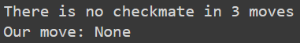
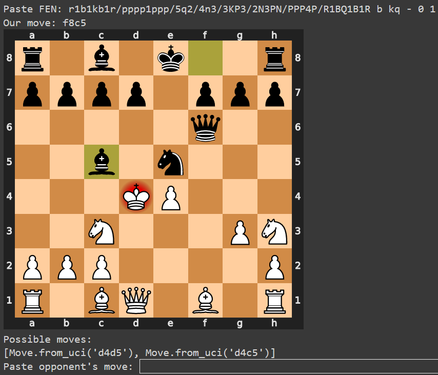
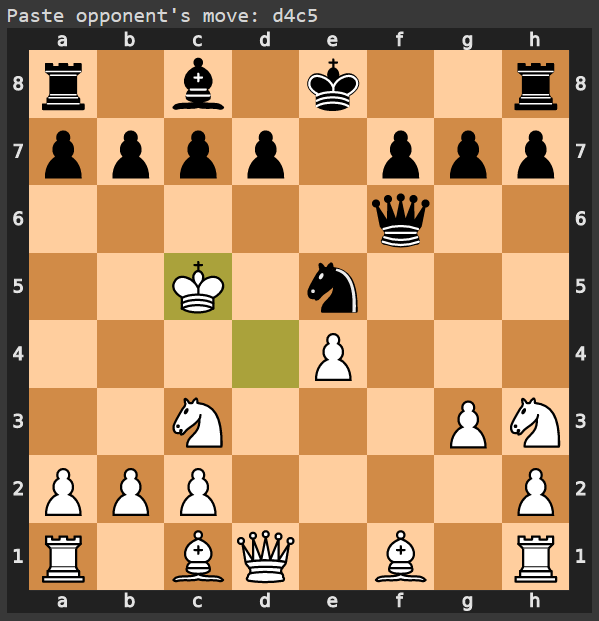
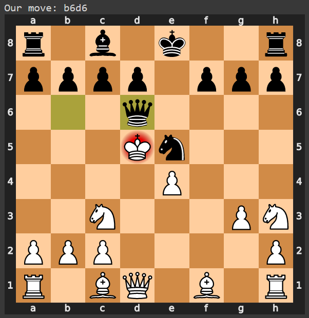

# ChessMateIn3
A projekt egy matt 3 lépésben feladvány megoldót valósít meg. 

A projektet készítették:
- Csabai Balázs
- Ujvári Máté
- Vizsy Domonkos

## Futtatás
A program futtatásának elkezdéséhez egy FEN bemenetre van szükség. Az alábbi linken matt 3 lépésben feladványok találhatóak: https://wtharvey.com/m8n3.txt.

A kiválasztott FEN bemásolása után, ha a feladvány nem megoldható kiírja, hogy "Nincsen matt 3 lépésből". (A fenti linken minden feladvány megoldható 3 lépésben, nemleges válaszért a https://wtharvey.com/m8n4.txt linken találhatóak 4 lépésben megoldható feladványok.)

Ha a feladvány megoldható, megad egy lehetséges első lépést, majd az ellenfél válaszát kéri, megjeleníti a jelenlegi állást a sakktáblán és kiírja a lehetséges összes lépését az ellenfélnek. Így megadhatjuk akár a saját lépésünket is a feladványban szereplő lépés mellett. 

Ha véletlen nem szabályos lépést adunk meg, akkor új bemenetet kér a program: 

Ha jó a megadott lépése az ellenfélnek, akkor ezt is megjeleníti:

Majd a program megadja a választott lépésre a matthoz vezető következő lehetséges lépést és újból az ellenfél lépését kéri. 

Az ellenfél következő lépése: 

Végezetül a matt:

